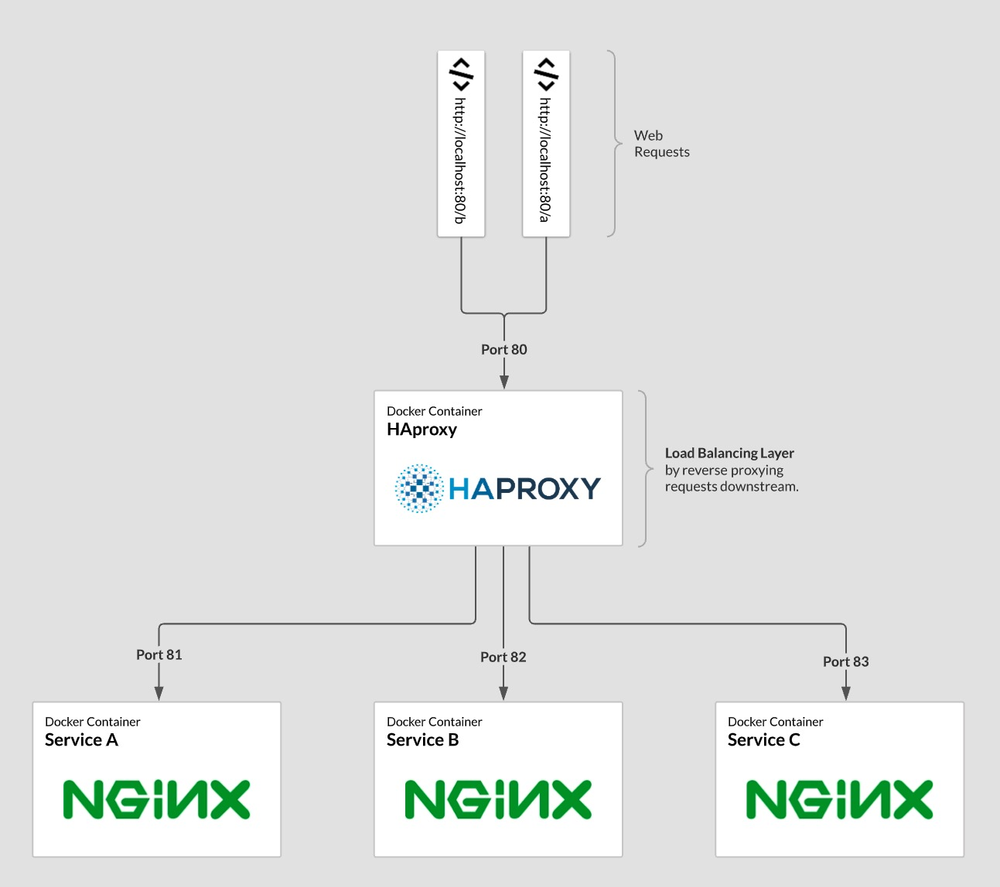

# HAproxy + nginx



## Force build ignoring cache

```bash
docker-compose build --no-cache && docker-compose down && docker-compose up
```

## Testing

### Route for /a

```bash
➜  docker-compose-haproxy-nginx curl localhost/a 
welcome to A

➜  docker-compose-haproxy-nginx curl localhost/a/
welcome to A

➜  docker-compose-haproxy-nginx curl localhost/a/otherfile.html
otherfile for A
```

### Route for /b

```bash
➜  docker-compose-haproxy-nginx curl localhost/b               
welcome to B

➜  docker-compose-haproxy-nginx curl localhost/b/
welcome to B

➜  docker-compose-haproxy-nginx curl localhost/b/otherfile.html
otherfile for B
```

```bash

.-:.     ::-.   ...         .        :    :::. ::::::::::::.,::::::     ...     
 ';;.   ;;;;'.;;;;;;;.      ;;,.    ;;;   ;;`;;;;;;;;;;'''';;;;''''  .;;;;;;;.  
   '[[,[[[' ,[[     \[[,    [[[[, ,[[[[, ,[[ '[[,   [[      [[cccc  ,[[     \[[,
     c$$"   $$$,     $$$    $$$$$$$$"$$$c$$$cc$$$c  $$      $$""""  $$$,     $$$
   ,8P"`    "888,_ _,88P    888 Y88" 888o888   888, 88,     888oo,__"888,_ _,88P
  mM"         "YMMMMMP"     MMM  M'  "MMMYMM   ""`  MMM     """"YUMMM "YMMMMMP" 

  holla at me
```

https://matthewdavis.io